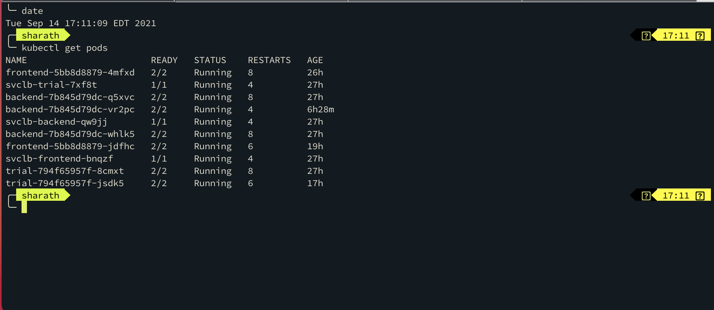
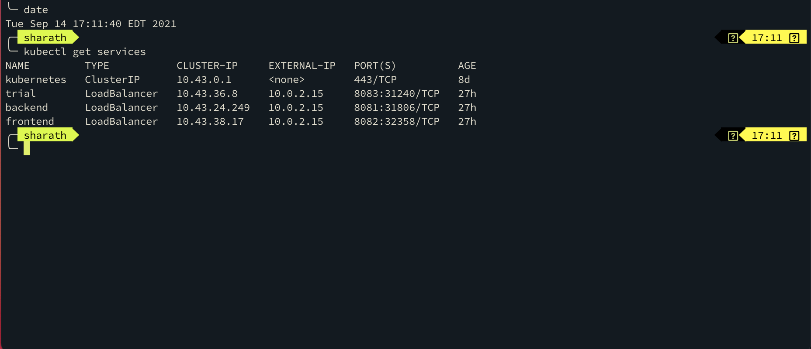
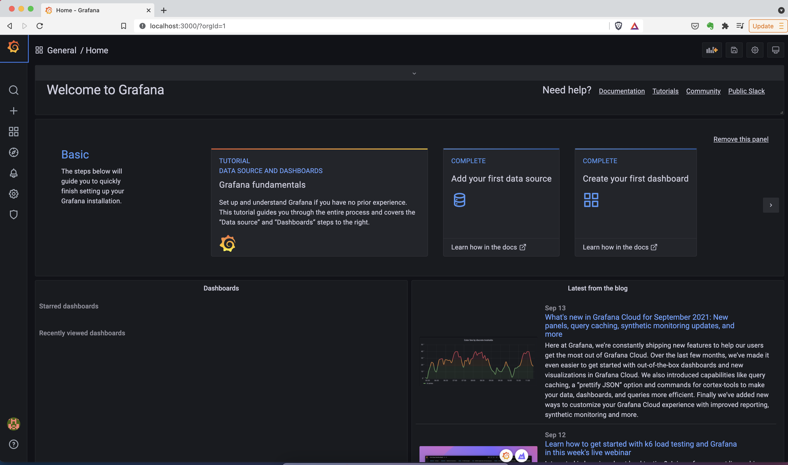
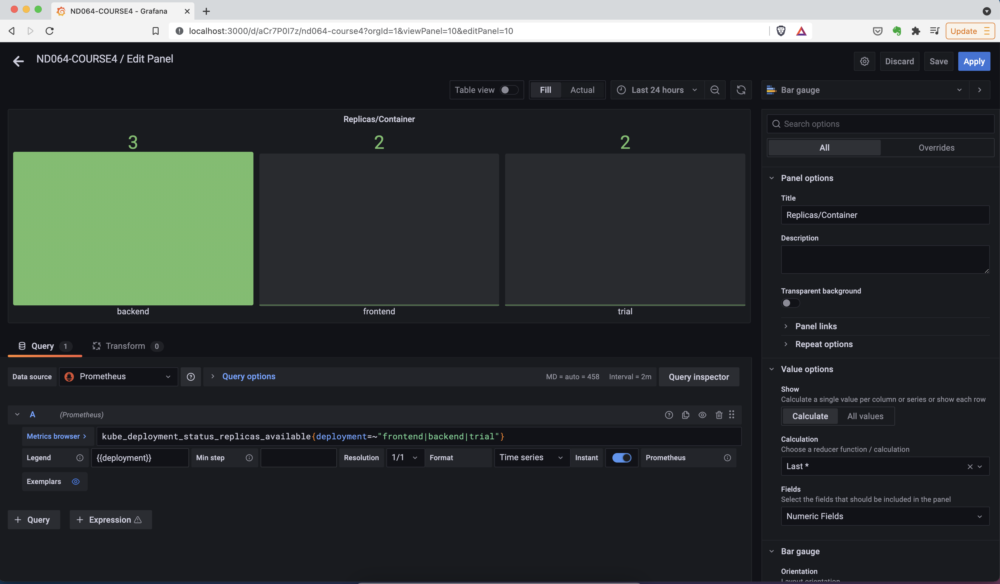
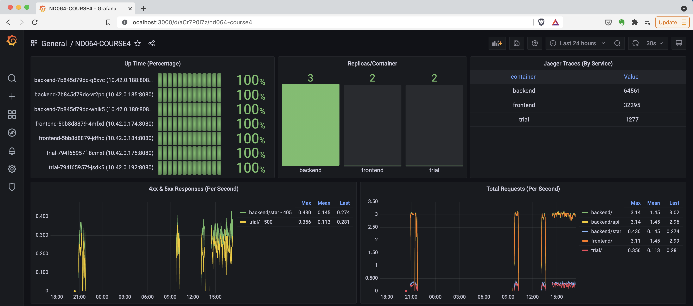
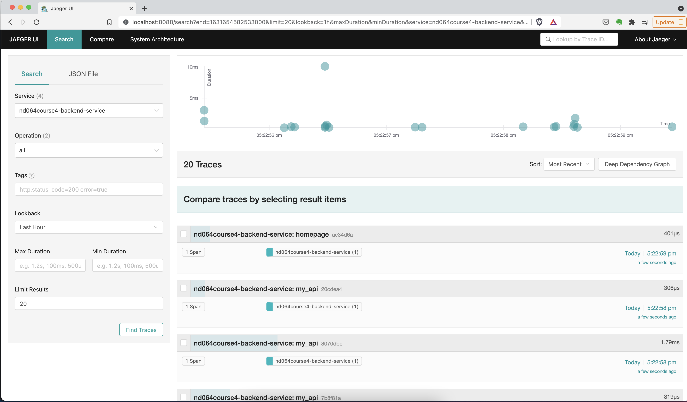
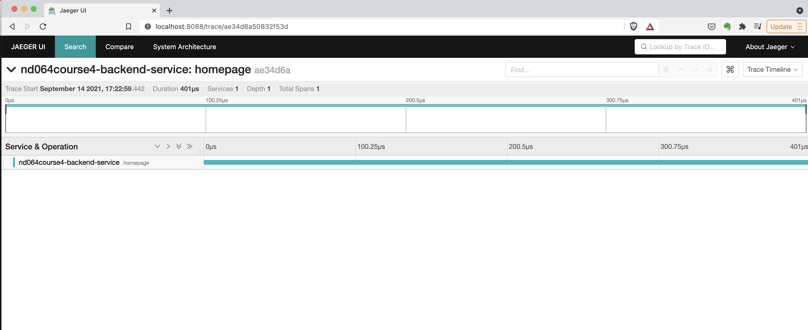
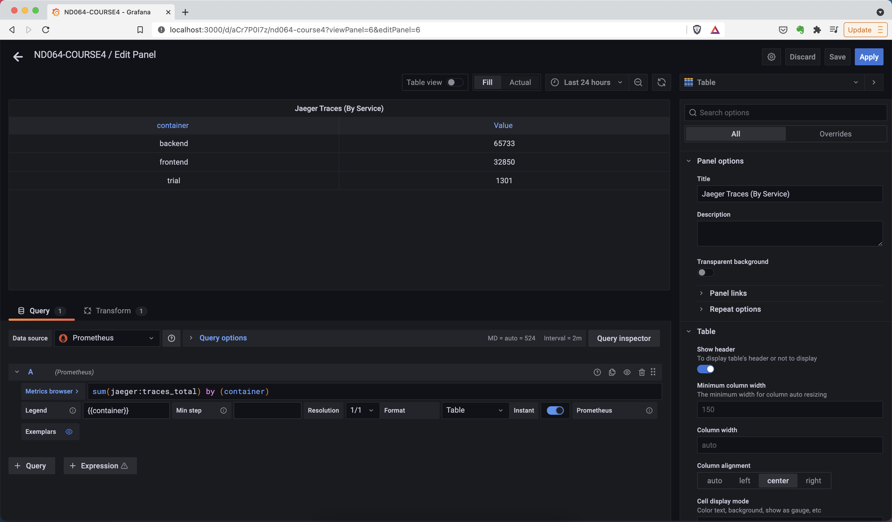
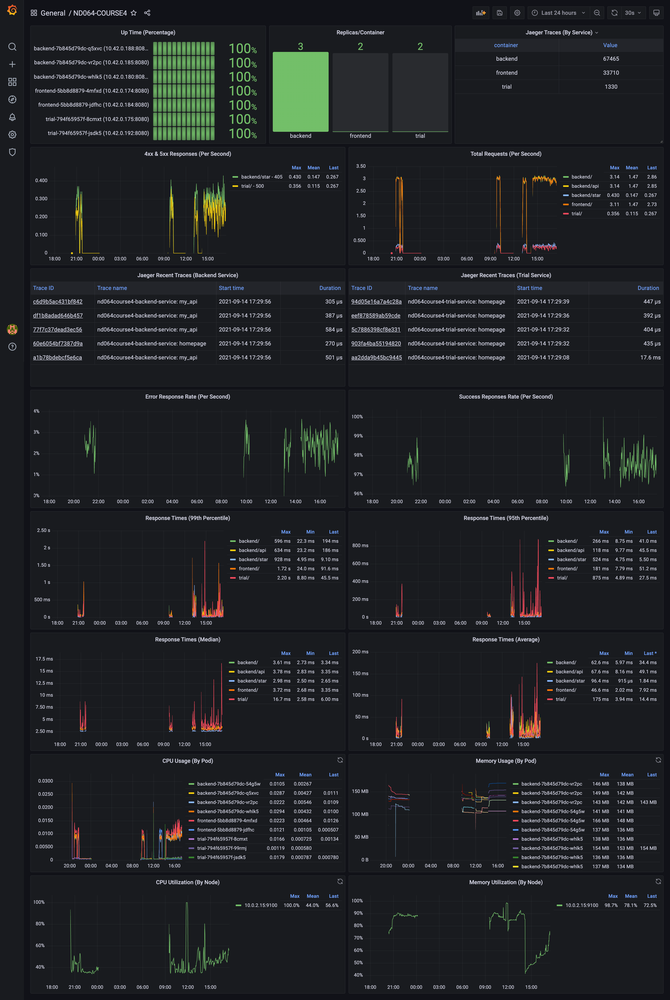

**Note:** For the screenshots, you can store all of your answer images in the `answer-img` directory.

## Verify the monitoring installation
### *TODO:* run `kubectl` command to show the running pods and services for the three components. Copy and paste the output or take a screenshot of the output and include it here to verify the installation
#### Pods

#### Services

## Setup the Jaeger and Prometheus source
### *TODO:* Expose Grafana to the internet and then setup Prometheus as a data source. Provide a screenshot of the home page after logging into Grafana.

## Create a Basic Dashboard
### *TODO:* Create a dashboard in Grafana that shows Prometheus as a source. Take a screenshot and include it here.

## Describe SLO/SLI
### Describe, in your own words, what the SLIs are, based on an SLO of *monthly uptime* and *request response time*.
#### Monthly Uptime
* Uptime could be measured based on health check (`up` kubernetes/prometheus metric) of each service instance (pod)  
* Another way to measure uptime is the ratio of non-5xx status responses to total responses  
* Uptime in this specific case could be measured/reported for `frontend`, `backend` & `trial` components separately.
#### Request Response Time
* Average & Percentile response times (in ms) of endpoints exposed by `frontend`, `backend` & `trial` components are the SLIs to be considered for `request response time` SLO. 

## Creating SLI metrics.
### It is important to know why we want to measure certain metrics for our customer. Describe in detail 5 metrics to measure these SLIs.
#### 1. Uptime
The percentage of time a service/component is up and working as expected, usually measured per month, year etc.
#### 2. Error Rate
The percentage of requests to a service/component that are not successful, errors can occur due to multiple reasons such as a service/component is not available/up, for HTTP APIs 5xx (server) responses are considered errors.
#### 3. Traffic 
The number of requests being serviced by a service/component in a unit of time, in case of HTTP requests usually measured as requests/second.
#### 4. Latency 
Time taken by a service/component to respond to a request, usually measured as average, 95th percentile, 99th percentile etc.
#### 5. Resource Usage/Saturation
The usage of a resource by a given service/component.  Frequently used are CPU, Memory & Disk Usage. Usually measured as percentage of the total capacity, or could be absolute quantities as well (CPU = seconds, Disk Usage = MB/GB/TB, Memory = KB/MB/GB)

## Create a Dashboard to measure our SLIs
### *TODO:* Create a dashboard to measure the uptime of the frontend and backend services We will also want to measure 40x and 50x errors. Create a dashboard that show these values over a 24 hour period and take a screenshot.

## Tracing our Flask App
### *TODO:*  We will create a Jaeger span to measure the processes on the backend. Once you fill in the span, provide a screenshot of it here.
#### Jaeger - Home

#### Jaeger - Single Trace View

## Jaeger in Dashboards
### *TODO:* Now that the trace is running, let's add the metric to our current Grafana dashboard. Once this is completed, provide a screenshot of it here.

## Report Error
### *TODO:* Using the template below, write a trouble ticket for the developers, to explain the errors that you are seeing (400, 500, latency) and to let them know the file that is causing the issue.
* TROUBLE TICKET # 1:
    * Name: Trial App - `homepage` - HTTP 500
    * Date: 09/14/2021
    * Subject: Trial App - Incorrect `homepage` implementation
    * Affected Area: `trial` application's `/` API
    * Severity: CRITICAL
    * Description: The implementation incorrectly returns `render_template("main.html")` on the first line of the method `homepage`.  This results in the application returning HTTP 500 error.  The application/API seems to indicate it should return JSON, so, the resolution step is to remove/delete that first line.
* 
* TROUBLE TICKET # 2:
    * Name: Backend App - `star` - HTTP 500
    * Date: 09/14/2021
    * Subject: Backend App - Missing MongoDB resource
    * Affected Area: `backend` application's `/star` API
    * Severity: CRITICAL
    * Description: The implementation of `/star` API refers to a non-existent MongoDB resource - `mongodb://example-mongodb-svc.default.svc.cluster.local:27017/example-mongodb`.

## Creating SLIs and SLOs
### *TODO:* We want to create an SLO guaranteeing that our application has a 99.95% uptime per month. Name three SLIs that you would use to measure the success of this SLO.
The following SLI Metrics would be used to measure a given application/service/component's Uptime SLO per month:
* Uptime
* Error Rate (or Success Rate could also be used)
* Response Times (Average or Percentiles such as 95th or 99th) 

## Building KPIs for our plan
### *TODO*: Now that we have our SLIs and SLOs, create KPIs to accurately measure these metrics. We will make a dashboard for this, but first write them down here.
KPIs for each SLI/SLO
#### 1. Uptime
* Uptime
* Number of Instances/PODs (vs Configured)
* Success Requests Percentage/second
#### 2. Error Rate
* Number of Errors/second
* Error Percentage/second
#### 3. Traffic 
* Number of Requests/second
* Number of Traces/second
* Number of Successful Requests/second
#### 4. Latency
* 99th Percentile Response Time
* 95th Percentile Response Time
* Media (or 50th Percentile) Response Time
* Average Response Time
#### 5. Resource Usage/Saturation
* % CPU Usage (Per Node)
* % Memory Usage (Per Node)
* CPU Usage (Per Pod/Instance)
* Memory Usage (Per Pod/Instance)

## Final Dashboard
### *TODO*: Create a Dashboard containing graphs that capture all the metrics of your KPIs and adequately representing your SLIs and SLOs. Include a screenshot of the dashboard here, and write a text description of what graphs are represented in the dashboard.  
